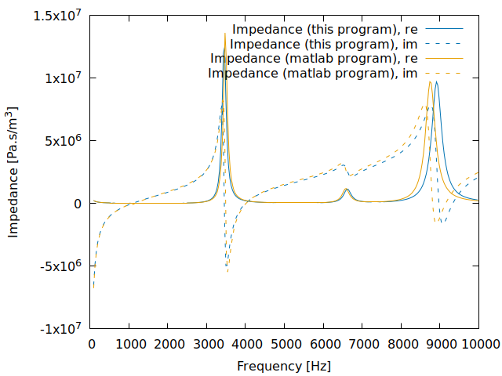

# Overview

The program created for Milestone 1 of this project solves the equations that describe
the response of a rigid membrane to an external force that acts perpendicular to the
membrane. Specifically, it solves the following partial differential equation:
```
  -omega^2 rho h  z(x,y)
    + D (d^2/dx^2 + d^2/dy^2)(d^2/dx^2 + d^2/dy^2)  z(x,y)
    - T (d^2/dx^2 + d^2/dy^2)  z(x,y)
    = P(x,y),
```
where for the moment, `P(x,y)=1`. The current version of this program solves this
equation on a square domain, but it has also been tested on circles and will, with
minor modifications to less than a dozen lines of code, be able to solve the
equation above on any mesh read from a file.

For a thin plate, the bending constant _D_ is related to other
parameters via
```
  D = (E h^3) / (12 (1-nu^2)
```
where _E_ is Young's modulus, _h_ the thickness of the plate, and _nu_
is Poisson's ratio.

As boundary conditions, the program assumes that both the vertical deflection is
zero at the boundary, and that the plate is clamped there with a zero slope. In
other words, at the boundary the program assumes that
```
  z     = 0,
  dz/dn = 0.
```

The program solves these equations for a range of frequencies `omega` to compute
a frequency-dependent response to an external, temporally oscilating vertical 
force `P(x,y)`.

The underlying method used for the solution of the equation is the finite element
method (FEM). By default, finite element methods have difficulty dealing with
fourth order problems and historically, many complicated modifications have been
made to it for this kind of problem. Here, we instead rely on the "`C^O` Interior
Penalty" (C0IP) method by Brenner et al. The method is published in the following
article:

>   Susanne C. Brenner and Li-Yeng Sung:
>   "$C^0$ Interior Penalty Methods for Fourth Order Elliptic Boundary Value Problems on Polygonal Domains",
>   Journal of Scientific Computing, vol. 22-23, pp. 83-118, 2005.


# Input

The program reads the parameter values that determine what is to be computed from a
file called `biharmonic.prm`. This file looks as follows:
```
set Mesh file name            = ./square_mesh.vtk

set Thickness                 = 0.0001
set Density                   = 100
set Loss angle                = 2
set Young's modulus           = 200e6
set Poisson's ratio           = 0.3
set Tension                   = 30

set Frequencies               = linear_spacing(100,1e4,100)

set Number of mesh refinement steps  = 5
set Finite element polynomial degree = 2

set Number of threads         = 0
```
The first of these parameters, obviously, corresponds to the name of a
file that contains the mesh (in [VTK
format](https://vtk.org/wp-content/uploads/2015/04/file-formats.pdf))
that describes the domain on which to solve the PDE (i.e., the shape
of the membrane).

The second and block describes the mechanical properties of the
membrane. All parameters are given in SI units. `Loss angle` is
dimensionless and interpreted in degrees. The minimal and maximal
frequencies are intrepreted in Hz.

The third block describes the frequencies that should be
computed. There are three possibilities for this parameter:

  - Specify `linear_spacing(f1,f2,nsteps)`: This computes `nsteps`
    frequencies between `f1` and `f2` (given in Hz) with equal spacing
    between frequencies.
  - Specify `exp_spacing(f1,f2,nsteps)`: This computes `nsteps`
    frequencies between `f1` and `f2` (given in Hz) with equal spacing
    between the logarithms of frequencies. In other words, the gaps
    between successive frequencies grow exponentially: On a log plot,
    the frequencies so computes are equall spaced.
  - Specify `list(f1,f2,f3,...)`: Here, the program computes all of
    the frequencies explicitly listed between parentheses. The list
    may have any length, as long as it contains at least one element.

The fourth block of parameters shown above describes properties of the
discretization, i.e., of _how_ the problem (formulated as a PDE)
should be solved rather than what the problem actually is. In
particular, the parameters list the number of mesh refinement steps
(each refinement step replaces each cell of the mesh by its four
children) as well as the polynomial degree of the finite element
approximation.

The number of mesh refinement steps is interpreted in the following
way: If it is positive or zero, then the mesh on which the solution is
computed is simply the mesh taken from the file listed in the first
parameter, this many times refined by replacing each cell by its four
children in each refinement step. In particular, this leads to using
the same mesh for all frequencies.

On the other hand, if the number of mesh refinement steps is negative,
then the mesh is adapted using the following algorithm. For given
thickness _h_, density _rho_, Young's modulus _E_, and Tension _T_
parameters, we can compute the wave speed in the medium. This can be
done by setting _z(x,y)=sin(kx-wt)_ in the equation above and _P=0_,
and then computing which value for _w_ satisfies the equation for a
given _w_. This yields a "dispersion relationship" of the form
```
  -rho h w^2 + D k^4 + T k^2 = 0
```
or equivalently
```
  w = sqrt{ (D k^4 + T k^2) / (rho h) }.
```
This is not useful, because it does not provide us with a wave speed
_c=w/k_ that is constant, but instead one that depends on the
frequency of the wave. On the other hand, we can compute wave speeds
for the extreme cases where either _D=0_ or _T=0_, i.e., for a pure
membrane or pure plate. We can then take the maximum of the two as an
indication of how fast a wave would traverse the medium:
```
  c = max{ sqrt{ T / (rho h) }, sqrt{ D k^2 / (rho h) } }
    = max{ sqrt{ T / (rho h) }, sqrt{ D (w/sqrt{D / rho h}) / (rho h) } }
    = max{ sqrt{ T / (rho h) }, sqrt{ sqrt{D / (rho h)} w } }.
```
With this formula, we can compute the wavelength of oscillations for a
given frequency _w_ via
```
  lambda = c/f
         = c/(w/(2pi))
         = 2 pi max{ sqrt{ T / (rho h) } / w, {D / (rho h)}^(1/4) / sqrt{ w } }.
```
If `lambda` is larger than the diameter of the domain, then we replace
it by the diameter of the domain since that is the largest wavelength
at which the solution can vary.
We can then determine a frequency-adapted mesh size in the following
way: We want that there are at least _N_ grid points per wave
length. Since there are as many grid points per cell as the polynomial
degree _p_, this equations to requiring that the mesh size _Delta x_
satisfies _Delta x / p <= lambda/N_
or equivalently: _Delta x <= lambda/N * p_. The `Mesh refinement steps`
parameter is then interpreted as _N_ if it is negative.

The last parameter, `Number of threads`, indicates how many threads
the program may use at any given time. Threads are used to compute
the frequency response for different frequencies at the same time
since these are independent computations. A value of zero means that
the program may use as many threads as it pleases, whereas a positive
number limits how many threads (and consequently CPU cores) the
program will use.


# Output

The output of the program consists of two pieces, the frequency response file and the visualization
directory.

### The file `frequency_response.txt`

This file contains one line for each input
frequency omega, and in each line lists the following information:

  - The frequency, calculated as `omega/2/pi`.
  - The normalized response of the rigid membrane, as computed by the following
    equation:
    ```
      \int z(x,y) dx dy  /  \max_{x,y} |P(x,y)|.
    ```
    The output file contains both the real and imaginary component of
    this quantity. Its units are `m^3/Pa`.
  - The impedance, which is calculated as
    ```
      \max_{x,y} |P(x,y)|  /  (j  omega  \int z(x,y) dx dy).
    ```
    The output file contains both the real and imaginary component of
    this quantity. Its units are `(Pa.s)/m^3`.
  - The normalized maximal displacement of the rigid membrane, as computed by the following
    equation:
    ```
      \max_{x,y} |z(x,y)|  /  \max_{x,y} |P(x,y)|.
    ```
    This is a real-valued quantity. Its units are `m/Pa`.
  - The name of the visualization file (see below) for this frequency.

A summary of what each line corresponds to can be found at the top
of the file.


### Monitoring progress

The `frequency_response.txt` file is updated every time the program
has finished computing the response of the membrane for a particular
frequency. As a consequence, the file contains a record of all
computed frequencies.

To monitor the progress of computations -- for example for displaying
a progress bar -- open this file periodically (say, once a second) and
read what's in it. If all you want is to show progress: The first line
of the file has a format that, during computations, says something
like "`# 42/100 frequencies computed`", allowing for a quick overview
where computations currently are. If you want something
fancier, you can actually parse the contents of the file and update a
graph of the frequency-dependent membrane response every time you read
through the file. This way, the graph will fill in over time.


### The directory `visualization/`

This directory contains one file for each input frequency, with each file providing
all of the information necessary to visualize the solution. The format used for these
files is VTU, and the solution can be visualized with either the
[Visit](https://wci.llnl.gov/simulation/computer-codes/visit) or
[Paraview](https://www.paraview.org/) programs.
The file names are of the form `visualization/solution-XXXXX.vtu` where `XXXXX`
denotes the (integer part of the) frequency (in Hz) at which the solution
is computed. However, it is easiest
to just take the file name from the `frequency_response.txt` file to find which
file corresponds to which frequency.


# Terminating execution

There may be times where callers of this program do not want it to continue with
its computations. In this case, an external program should place the text `STOP`
into a file called `termination_signal` in the current directory. This will
not immediately terminate the program; instead, it will finish the computations
for the input frequencies it is currently working on, but not start computations
for any further frequencies. To signal that the program has received
the message, once the termination signal has been detected, the
program also removes the `termination_signal` file.

Since computations on each frequency typically take
no more than a couple of seconds, this implies that the program terminates not
long after. The last step of the program is to output data for all of the
frequencies already computed into the `frequency_response.txt` file. In other
words, one has to wait for the actual program termination before reading the
results.

The program works on input frequencies in an unpredictable order, since work
for each frequency is scheduled with the operating system at the beginning
of program execution, but it is the operating system's job to allocate CPU
time for each of these tasks. This is often done in an unpredictable order.
As a consequence, the frequencies already worked on at the time of termination
may or may not be those listed first in the input file.


# How this program was tested

I have used two different ways to test the correctness of this program.
These are described below.

## Method of manufactured solutions

The "method of manufactured solutions" starts by choosing a function `Z(x,y)`
(often a combination of sines, cosines, and exponentials, but not pure
polynomials) and putting it into the equation for `z` stated at the
top of this document. For given values of the parameters `omega`, `rho`,
`h`, `D`, and `T`, one can then evaluate what pressure `P(x,y)` would be
necessary to produce this solution `Z`. This pressure `P(x,y)` is then
used as the right hand side in the program and one computes a numerical
approximation `z_h` to the solution `z=Z` of the equation for the set
of parameters used to compute `P`. It should of course
of course be close to `Z`, and furthermore, one would expect that the `z_h`
converges to `Z` as the mesh is refined, with a rate that can be inferred
from theory.

I have done this for a number of choices for `Z`, and verified both that
`z_h` is close to `Z`, and converges at the correct rate.


## Comparison with a matlab code

The second mode of comparison is with a matlab code written by Jason
McIntosh. It solves the same set of equations, but using a finite
difference method.

In the following, we show some results that compare the output of these
two programs. The initial results show that the results are largely
similar, but do have some differences. We explain these further below.

In these experiments, we use the following set of material parameters:
```
    h            = 0.000100;               // 100 microns
    rho          = 100;                    // kg/m^3
    E_angle      = 2*pi * 2./360.;         // 2 degrees
    E            = 200e6 * exp(j*E_angle); // Pa
    nu           = 0.3;                    // (Poisson's ratio)
    D            = E*h^3/12/(1-nu^2).
    T            = 30;                     // 1 N/m
```
The domain is a square with edge length `0.015m = 15mm`.


### Pure plate case

The pure plate case can be obtained by setting `T=0`. The impedances computed
by the two codes then look as follows:


### Pure membrane case

The pure plate case can be obtained by setting `D=0`. The impedances computed
by the two codes then look as follows:


Since the only place in the equation that contains a complex-valued coefficient
is the fourth-order term with `D`, setting `D=0` results in a solution `z` that
is purely real with no imaginary part. Given the definition of the impedance,
this results in a purely imaginary impedance with no real part. The figure
reflects this.


### Combined case

Using both `D` and `T` nonzero with the values provide above, one obtains the
following comparison:


### Interpretation

The results for the two codes look qualitatively very similar, with matching
amplitudes (except at the peaks of resonances where the actual value of the
amplitude depends quite sensitively on what values of omega were used to
draw the curves) and generally also matching resonance frequencies. At the
same time, it is useful to understand where the differences may be from.

To this end, we have investigated the "pure plate" case further. For reference,
this is again the comparison between the code produced for this project and
the pre-existing matlab code:


The matlab code in its original form uses 10 grid points per wavelength. This
is generally a reasonable choice, but in this case more accuracy can be
obtained by instead using 20 grid points per wavelength. The comparison
is then as follows:


This minor modification illustrates that a higher mesh refinement in the
matlab code leads to a far better match of at least the lowest resonance.
On the other hand, it leaves two areas of discrepancy: The area below
1000 Hz, and the third (and probably higher) resonances.

The low-frequency discrepancy is also easily addressed: The matlab code
by default uses 10 points per wave length, but a minimum of 15 per
coordinate direction if the wave length is very long. Increasing this
minimum to 50 instead results in the following plot:


In other words, this further modification to the matlab code resolves
the discrepancy at the lowest frequencies.

Finally, the fact that now the code developed herein places the
resonance to the *right* of the matlab code (where it was to the left
before increasing the matlab mesh resolution) suggests that the
current code uses a mesh that is too coarse. Refining the mesh one
more time (i.e., halving the mesh size) then results in the following image:



The resonances close to 9000 Hz are now closer together. This suggests
that an even finer mesh in the current code would lead to an even better
agreement. On the other hand, initial tests suggest that this has only a
marginal effect and further experimentation with both programs will
be necessary.

